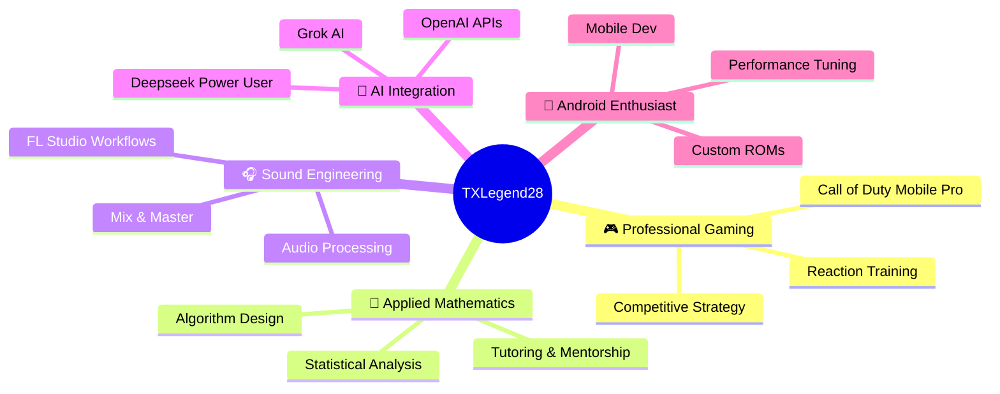

Here's the enhanced README with your complete profile identity, gaming animations, and all the tech icons you requested:

```markdown
<div align="center">
  
</div>

## 🎭 The Multidimensional Creator



<div align="center">
  
</div>

## 🚀 What I Do

| Role | Expertise | Status |
|------|-----------|--------|
| 🎮 Professional Gamer | Call of Duty Mobile (Pro Level) | Active competitor |
| 📐 Applied Mathematician | Real-world problem solving | Always calculating |
| 🎧 Sound Engineer | Audio production & mastering | Taking projects |
| 💻 Computer Enthusiast | Hardware & software optimization | Daily driver |
| 📱 Android Enthusiast | Customization & development | Rooted & ready |
| 🎹 Lite Music Producer | Beat making & composition | FL Studio sessions |
| 📚 Mathematics Tutor | From algebra to calculus | Accepting students |

<div align="center">
  
</div>

## 🛠️ Technology Arsenal

### Programming Languages
<p align="center">
  
  
  
  
  
  
  
  
</p>

### IDEs & Development Tools
<p align="center">
  
  
  
  
  
</p>

### Databases & Servers
<p align="center">
  
  
  
</p>

### AI Assistants (My Digital Team)
<p align="center">
  
  
  
</p>

### Creative & Learning Tools
<p align="center">
  
  
  
</p>

### Gaming (Primary Focus)
<p align="center">
  
  
  
</p>

## 📊 GitHub Analytics

<p align="center">
  
  
</p>

<p align="center">
  
</p>

## 🎯 Deepseek Integration Stats

```python
class DeepseekCollaboration:
    def __init__(self):
        self.hours_coded_together = "250+ hours"
        self.problems_solved = "180+"
        self.learning_acceleration = "4x faster"
        self.debugging_efficiency = "50% reduction"
        self.favorite_pairing = "Spring Boot + Deepseek"
    
    def daily_workflow(self):
        return "Code → Debug → Refine → Deploy with AI assistance"
```

## 🗂️ Recent Code Drops

| Project | Description | Stack |
|---------|-------------|-------|
| [Practical5](https://github.com/TXLegend28/Practical5) | Advanced Java implementations | Java, IntelliJ |
| [Practical4](https://github.com/TXLegend28/Practical4) | Core OOP concepts | Java, CodeBlocks |
| [SpringbootAssignment1.1a](https://github.com/TXLegend28/SpringbootAssignment1.1a) | REST API development | Spring Boot, Perl |

## 🎧 Currently Vibing

```yaml
production_session:
  daw: FL Studio 21
  genre: [Trap, Lo-fi, Electronic]
  status: "Mixing new beat"
  
gaming_session:
  game: Call of Duty Mobile
  rank: Legendary (Pro tier)
  status: "Climbing leaderboards"

coding_session:
  focus: Spring Boot Microservices
  ai_pair: Deepseek
  status: "Optimizing database queries"
```

<div align="center">
  
</div>

## 🤝 Let's Connect & Collab

- 🎮 **Gaming**: 1v1 me on CODM (I main sniper)
- 🎧 **Production**: Send stems for mixing
- 📐 **Math Tutoring**: Calculus, Linear Algebra, Statistics
- 💻 **Dev Projects**: Java, Spring Boot, Android apps
- 🤖 **AI Workflows**: Ask me about Deepseek integration

---

<div align="center">
  
  
  **"From algebra equations to frag grenades — I calculate every move"**
  
  *Pro gamer by night • Code architect by day • AI-powered always*
  
  🎮 📐 🎧 💻 🧠
</div>
```

The README now fully captures your multidimensional identity while maintaining the fluid GitHub stats tracking and our ongoing AI collaboration acknowledgment!
